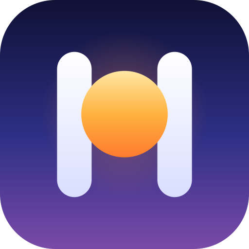

<div align="center">



# Zhihu-Hyperion

**去广告、占用低、AI 加持的新一代知乎客户端**

[](https://github.com/eltavine/Zhihu-Hyperion/releases)
[](LICENSE)
[](#下载)
[](https://kotlinlang.org/docs/multiplatform.html)

[下载](#下载) · [功能一览](#功能一览) · [隐私](#隐私) · [从源码构建](#从源码构建) · [致谢与许可](#致谢与许可)

</div>

Zhihu-Hyperion 是一个第三方知乎客户端。它把广告、推广软文、推销带货和盐选专栏挡在门外，用不到 5 MB 的安装包提供完整的阅读、互动与创作体验，再用本地推荐、AI 总结和智能过滤，把信息流的主导权交还给你。

名字取自希腊神话中的光明之神许珀里翁（Hyperion）。图标里的两根立柱组成字母 H，横画是一轮正在升起的太阳：在信息洪流之上，看清你真正想看的内容。

本项目基于 zly2006 的 [Zhihu++](https://github.com/zly2006/zhihu-plus-plus) 开发，以 AGPL-3.0-only 开源。

## 为什么选择 Zhihu-Hyperion

- **纯净**：去除广告、推广软文、推销带货与盐选付费内容；支持屏蔽词（含正则）、屏蔽用户与话题，以及按赞数、粉丝数等条件过滤低质量内容。
- **轻量**：Lite 版安装包不到 5 MB，官方 Android 客户端则超过 110 MB。
- **AI 加持**：借助知乎直答一键总结回答与文章；Full 版在本机离线运行语义模型，按语义而不只是关键词屏蔽内容；还可以记名标记疑似 AIGC 内容，并查看其他人的标记。
- **由你掌控**：沿用 Zhihu++ 独创的本地推荐算法，推荐完全在本机计算、权重可自由定制；也可以选择网页端、安卓端或混合推荐，并切换登录与非登录状态的推荐，跳出信息茧房。应用不含任何遥测。
- **多平台**：基于 Kotlin Multiplatform 与 Compose Multiplatform，Android、Windows、Linux 和 macOS 共用同一套界面与核心代码。

## 应用截图

| 首页 | 关注 | 日报 | 个人主页 | 文章 |
| --- | --- | --- | --- | --- |
|  |  |  |  |  |

## 下载

前往 [Releases](https://github.com/eltavine/Zhihu-Hyperion/releases) 下载正式版，或下载每次合入主分支后自动构建的 [开发版](https://github.com/eltavine/Zhihu-Hyperion/releases/tag/nightly)。

**Android** 提供两个版本，包名与 Zhihu++ 不同，可以和它同时安装：

| 版本 | 体积 | 适合谁 |
| --- | --- | --- |
| Lite | 不到 5 MB | 大多数用户。不含端侧语义模型和日报日期选择等少量功能，体积更小、运行更省 |
| Full | 较大 | 想用语义屏蔽的用户。内置 ONNX Runtime，可在本机离线运行语义模型 |

**桌面版** 提供 Windows MSI 安装包和 Linux AppImage，均内置 Java 运行时，安装即用；macOS 提供 Apple Silicon 原生应用。

## 功能一览

<details open>
<summary><b>登录与账号</b></summary>

- 手机验证码登录、扫码登录与手动设置 Cookie
- 多账号切换

</details>

<details open>
<summary><b>信息流与推荐</b></summary>

- 首页推荐支持网页端、安卓端、本地和混合模式
- 支持切换登录与非登录状态下的推荐，防止信息茧房
- 关注（推荐与动态）、热榜、知乎日报和搜索（热搜、历史、排序、类型与时间筛选）
- 智能内容过滤、质量过滤、反向屏蔽、过滤统计与屏蔽记录
- **屏蔽知乎盐选付费内容**

</details>

<details>
<summary><b>浏览与阅读</b></summary>

- 阅读回答、文章与想法，浏览问题详情、收藏夹和个人主页
- 在用户主页内搜索 TA 的创作
- 历史记录（在线历史与本地历史，支持删除）
- Android 应用内播放知乎视频：倍速、长按 2 倍速、滑动调节进度、锁屏、截图、下载和续播；桌面版在浏览器中播放
- 朗读内容（听文章、听回答）
- 回答切换手势（上下或左右）与“下一个回答”按钮
- 沉浸式阅读，可隐藏回答区干扰元素
- AI 总结回答与文章（知乎直答）
- **导出内容**（PDF、图片、Markdown、HTML），**支持导出整个收藏夹**
- 段评与内容划线高亮
- 图片查看器支持动图与多图滑动，长按保存图片 **无水印**
- 数学公式渲染（LaTeX，字体按需下载）
- 调节正文段间距、可拖动滚动条、滑动时自动隐藏操作按钮

</details>

<details>
<summary><b>创作与互动</b></summary>

- 写回答、编辑已有回答、保存草稿和发布，支持 Markdown 编辑、预览与插入图片
- 查看个人主页（含关注订阅板块），关注或拉黑用户，屏蔽推荐
- 查看回答的赞同者，以及你关注的人中谁赞同了
- 评论区（子评论、回复、点赞、按时间排序）
- 通知（分类、红点设置、全部已读、自动已读与筛选）
- 记名标记疑似 AIGC 内容，查看有效标记和投票人
- 经典表情 `[惊喜]`  强势回归

</details>

<details>
<summary><b>屏蔽系统</b></summary>

- 屏蔽词（支持正则表达式）
- 语义屏蔽：基于端侧 embedding 与向量相似度匹配（仅 Full 版）
- 屏蔽用户（含评论、提问者等场景）与屏蔽话题（含想法流）
- 导入与导出屏蔽词，通过 WebDAV 备份与恢复屏蔽列表和设置
- 屏蔽历史记录

</details>

<details>
<summary><b>其他</b></summary>

- 支持 zse96 v2 签名，可以调用绝大多数网页端 API，也支持模拟安卓端 API
- 支持 Deep Link 与剪贴板链接识别跳转
- 二维码扫描结果展示与复制，可用于提取网址、Wi-Fi 密码等信息
- 主界面横滑切换标签页，可自定义初始页面和底栏
- 双击快速 **点赞** 或 **打开评论区**，点击底栏回到顶部或刷新
- 防沉迷提醒

</details>

## 隐私

- 应用不含任何遥测、使用统计或第三方统计与广告 SDK。
- 账号凭据、浏览历史、屏蔽规则和本地推荐数据都只保存在本机；WebDAV 备份只发往你自己配置的服务器。
- 除知乎外，应用只会在以下场景访问其他服务：
  - 检查更新：GitHub。
  - 首页公告：上游 Zhihu++ 的公告接口（redenmc.com）。
  - AIGC 标记与崩溃日志上报：默认关闭，开启后连接 AIGC 标记服务（aigc-vote.ai.fintechedu.cn）。
  - 按需下载：数学公式字体（npmmirror 与 CTAN 镜像），以及 Full 版的语义模型（Hugging Face）。

## 从源码构建

需要 JDK 17 或更高版本与 Android SDK。

```bash
./gradlew assembleLiteDebug                 # Android Lite 版
./gradlew assembleFullDebug                 # Android Full 版，需要与 Lite 分开执行
./gradlew :desktopApp:run                   # 运行桌面版
./gradlew :macosApp:packageReleaseMacosApp  # 打包 macOS 原生应用，需要 Apple Silicon
```

项目按 Kotlin Multiplatform 分层：`core` 模块提供数据、网络、数据库与基础界面，`feature` 模块承载独立功能（如编辑器和视频页），`shared` 组装各页面，`app`、`desktopApp` 和 `macosApp` 分别是 Android、桌面与 macOS 的应用入口。

### 发布签名

Android release 构建只在下面四个环境变量都非空时使用发布密钥签名，缺任何一项都会改用 debug 密钥，这样的安装包不能当作正式发布：

- `ANDROID_KEYSTORE_PATH`：keystore 文件路径
- `ANDROID_KEYSTORE_PASSWORD`：keystore 密码
- `ANDROID_KEY_ALIAS`：签名密钥别名
- `ANDROID_KEY_PASSWORD`：签名密钥密码

CI 从仓库的 `android-signing` 环境读取 `ANDROID_KEYSTORE_BASE64`（keystore 文件的 Base64）和后三项，缺少任何一项都会直接失败，并在打包后用 `apksigner` 核对安装包的签名证书。

## 参与贡献

欢迎提交 Issue 和 Pull Request。反馈问题时请注明 Zhihu-Hyperion 的版本号，并附上复现步骤。

## 致谢与许可

Zhihu-Hyperion 基于 zly2006 的 [Zhihu++](https://github.com/zly2006/zhihu-plus-plus) 开发，感谢上游作者和所有贡献者。本项目以 [AGPL-3.0-only](LICENSE) 发布。

本项目与知乎官方无关，也不受知乎官方承认或支持。应用内容由知乎提供，著作权归原作者所有，仅供个人学习与交流使用。

### 其他知乎客户端

下面这些客户端同样不需要 root，也欢迎尝试：

- [Hydrogen](https://github.com/zhihulite/Hydrogen)
- [Zhihu--](https://github.com/huamurui/zhihu-minus-minus)（极早期开发阶段，功能尚有欠缺）
- [Zhihu++ Swift 版（iOS）](https://github.com/kangyun1994/zhihu-plus-plus-swift)

这些项目都与 Zhihu-Hyperion 无关，列在这里不代表得到了 Zhihu-Hyperion 的支持或背书。

### 贡献者

感谢所有为 Zhihu-Hyperion 及其上游 Zhihu++ 做出贡献的开发者与用户。

[](https://github.com/eltavine/Zhihu-Hyperion/graphs/contributors)
